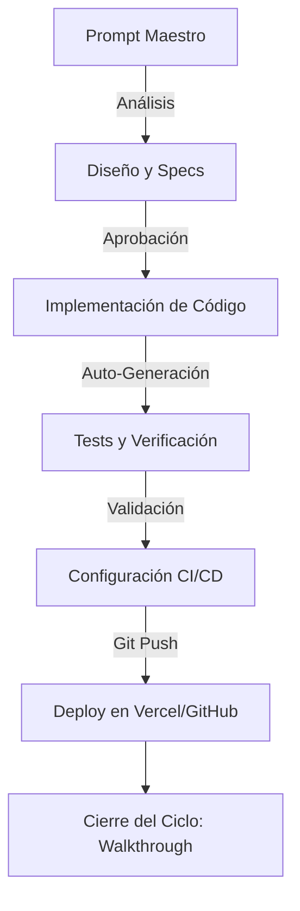

# Diseño: Laboratorio AI-First - Seller Command Center

Este documento detalla la arquitectura y el flujo de automatización para el laboratorio de Mercado Libre, utilizando una mentalidad "Zero to Deploy".

## El Prompt Maestro

Este es el prompt que el usuario ingresará en **Antigravity** para iniciar todo el proceso:

> "Actúa como un **Staff Engineer de Mercado Libre**. Crea el 'Seller Command Center', una aplicación premium en Next.js para vendedores. 
> 
> **Requerimientos:**
> 1. Dashboard con métricas clave (Ventas hoy, Reputación, Stock Crítico).
> 2. Gráfico de evolución de ventas usando una librería moderna.
> 3. Sección de 'AI Advisor' que analice el stock y sugiera acciones.
> 4. Estética 'Meli Premium': Glassmorphism, degradados amarillos/azules sutiles y tipografía 'Proxima Nova' (o similar).
> 
> **Flujo Automático:**
> - Genera la arquitectura y specs primero.
> - Implementa el código base con componentes reutilizables.
> - Crea tests unitarios para la lógica del AI Advisor.
> - Configura un workflow de GitHub Actions para validar el build.
> - Prepara el proyecto para despliegue inmediato en Vercel."

## Flujo de Vida del Software Automatizado

## Especificaciones Técnicas

### 1. Stack Tecnológico
- **Frontend:** Next.js (App Router), React, Tailwind CSS.
- **Gráficos:** Recharts o Lucide-react para iconos.
- **Testing:** Jest + React Testing Library.
- **Infraestructura:** Vercel (Frontend) + GitHub Actions (CI).

### 2. Estándares de Mercado Libre
- **UI/UX:** Seguir principios del sistema de diseño (Andes) adaptado a una estética premium.
- **Accesibilidad:** Cumplimiento de estándares WCAG.
- **Performance:** Optimización de Core Web Vitals.

## Plan de Acción Inmediato
1. **Andamiaje:** Inicializar proyecto Next.js limpio.
2. **Componentes Core:** Crear el layout y sistema de diseño.
3. **Lógica de Negocio:** Implementar el "AI Advisor" con mocks inteligentes.
4. **Despliegue:** Configurar el repositorio y el pipeline.
