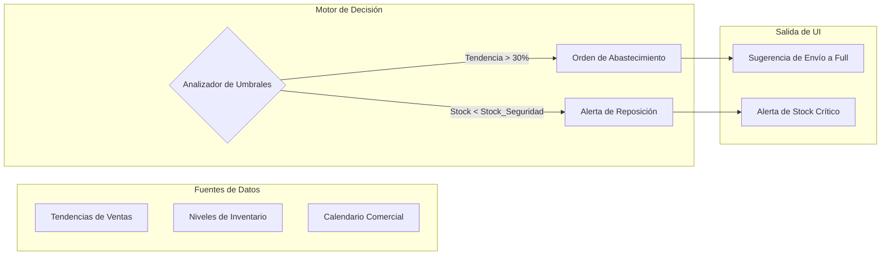

# AUTODOC: AI Insights Model (Lógica del Asesor)

Este documento detalla el funcionamiento interno del motor de recomendaciones del AI Advisor, explicando cómo transforma datos operativos en decisiones estratégicas.

## 1. Arquitectura del Advisor

El flujo de procesamiento de datos para la generación de recomendaciones sigue la siguiente estructura:

---

## 2. Definición del Modelo de Recomendación

### Criterios de Activación
El motor del Advisor opera bajo un modelo reactivo-predictivo con los siguientes parámetros:

1.  **Detector de Oportunidades (Tendencia)**:
    - **Variable**: Evolución porcentual de ventas en SKUs específicos.
    - **Umbral de Alerta**: Crecimiento proyectado superior al 30%.
    - **Acción Sugerida**: Migrar inventario a centros de distribución para asegurar fulfillment.

2.  **Protector de Ventas (Stock)**:
    - **Variable**: Velocidad de venta vs inventario disponible.
    - **Umbral de Alerta**: Baja disponibilidad crítica detectada.
    - **Acción Sugerida**: Reposición inmediata de SKUs en el panel de alertas.

---

## 3. Catálogo de Insights Soportados

| Insight | Razón de ser | Valor para el Vendedor |
| :--- | :--- | :--- |
| **Sugerir Envío a Full** | Evitar la pérdida de ventas ante un pico de demanda detectado por la IA. | Mayor exposición y delegación logística técnica. |
| **Alertas de Stock Crítico** | Mantener la continuidad operativa y evitar penalizaciones de servicio. | Protección de la reputación del vendedor. |

---

## 4. Resumen de Valor AI

El AI Advisor actúa como un analista de datos persistente. Su valor es la capacidad de conectar puntos que podrían ser ignorados en la operación diaria, presentando soluciones accionables para transformar la gestión de la tienda en una estrategia de crecimiento.
