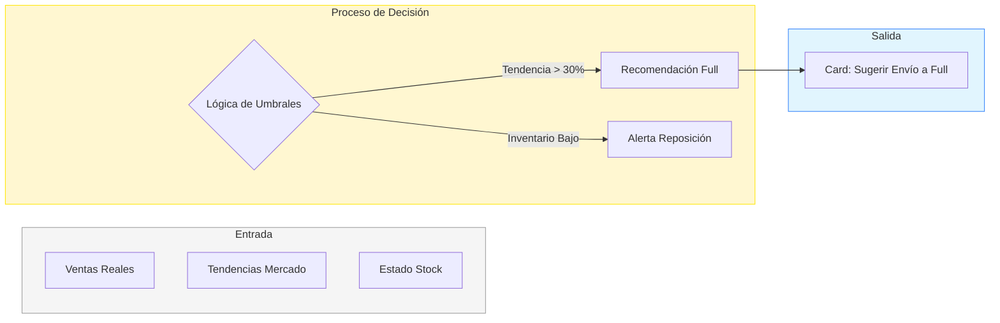

# AUTODOC: AI Insights Model (Lógica del Asesor)

Detalle de funcionamiento del motor de inteligencia artificial del Seller Command Center.

## 1. Arquitectura del Advisor

## 2. Definición del Modelo

### Criterios de Activación
- **Oportunidad**: Tendencia de demanda > 30% dispara sugerencia de modelo FULL.
- **Riesgo**: Ratio ventas/stock bajo genera alertas de reposición inmediata.

## 3. Catálogo de Recomendaciones
- **Sugerencia de Envío a Full**: Maximiza exposición y eficiencia logística.
- **Alertas de Stock Crítico**: Protege la continuidad de las ventas y la reputación.
