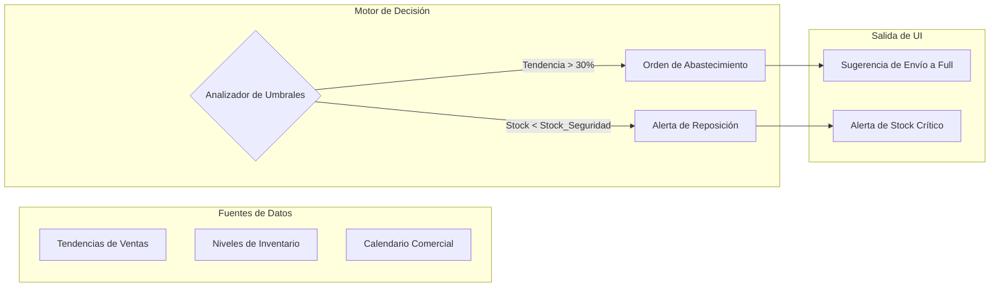

# AUTODOC: AI Insights Model (Lógica del Asesor)

Este documento detalla el funcionamiento interno del motor de recomendaciones del AI Advisor, explicando cómo transforma datos operativos en decisiones estratégicas.

## 1. Arquitectura del Advisor

El flujo de procesamiento de datos para la generación de recomendaciones sigue la siguiente estructura:

---

## 2. Definición del Modelo de Recomendación

### Criterios de Activación
El "cerebro" del Advisor opera bajo un modelo reactivo-predictivo con los siguientes parámetros:

1.  **Detector de Oportunidades (Tendencia)**:
    - **Variable**: Evolución porcentual de ventas en SKUs específicos.
    - **Umbral de Alerta**: > 30% de incremento proyectado.
    - **Acción Sugerida**: Migrar inventario a centros de distribución de Mercado Libre (Modelo FULL) para asegurar fulfillment rápido.

2.  **Protector de Ventas (Stock)**:
    - **Variable**: Velocidad de venta (Run rate) vs Stock disponible.
    - **Umbral de Alerta**: Disponibilidad menor a 3 días de venta proyectada.
    - **Acción Sugerida**: Reposición inmediata de SKUs detectados en el panel de alertas.

---

## 3. Catálogo de Insights Soportados

| Insight | Razón de ser | Valor para el Vendedor |
| :--- | :--- | :--- |
| **Sugerir Envío a Full** | Evitar la pérdida de ventas ante un pico de demanda detectado por la IA. | Mayor exposición en el marketplace y delegación logística. |
| **Alertas de Stock Crítico** | Mantener la continuidad operativa y evitar penalizaciones por "quiebre de stock". | Protección de la reputación del vendedor. |

---

## 4. Resumen de Valor AI

El AI Advisor actúa como un **Analista de Datos 24/7**. Su valor diferencial es la capacidad de conectar puntos que el vendedor podría ignorar (como una subida de tendencia silenciosa) y presentar una solución accionable en un solo click, transformando la gestión pasiva en una estrategia de crecimiento proactivo.

**Nota de Estilo**: Evitar el uso de iconos o emojis innecesarios en el documento final para mantener una estética profesional y limpia.
