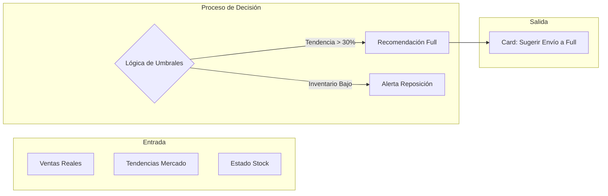

# AUTODOC: AI Insights Model (Lógica del Asesor)

Detalle de funcionamiento del motor de inteligencia artificial del Seller Command Center.

## 1. Arquitectura del Advisor

El flujo de procesamiento de datos para la generación de recomendaciones sigue la siguiente estructura:

## 2. Definición del Modelo

### Criterios de Activación
- **Motor de Oportunidad**: Se activa cuando la tendencia de demanda supera el 30%. El sistema infiere que el modelo de cumplimiento propio del vendedor será insuficiente y sugiere delegar en el centro de distribución del marketplace (Full).
- **Control de Riesgo**: Monitorea el ratio de ventas/stock para alertar sobre productos que están cerca de agotar existencias, protegiendo así la reputación del vendedor.

## 3. Catálogo de Recomendaciones
- **Sugerencia de Envío a Full**: Insight proactivo para maximizar exposición y eficiencia.
- **Alertas de Stock Crítico**: Notificaciones tácticas para evitar la interrupción de ventas.
