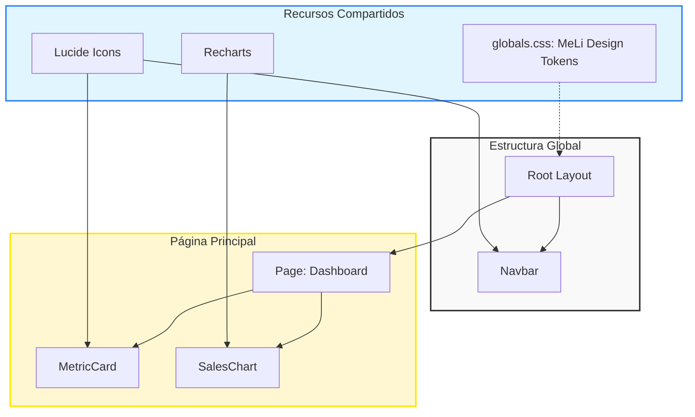

# AUTODOC: Arquitectura del Proyecto

Este documento ha sido generado automáticamente mediante el workflow `doc-arqueologo`.

## Tech Stack Overview

| Tecnología | Versión | Propósito |
| :--- | :--- | :--- |
| **Next.js** | 16.1.6 | Framework Core (App Router) |
| **React** | 19.2.3 | Librería de UI |
| **TypeScript** | 5.x | Lenguaje de programación |
| **Tailwind CSS** | 4.x | Estilizado (Utility-first) |
| **Recharts** | 3.7.0 | Visualización de datos |
| **Lucide React** | 0.575.0 | Iconografía |
| **Framer Motion** | 12.34.3 | Animaciones |

## Architecture Diagram

Este diagrama representa la jerarquía de componentes y el flujo de diseño del Seller Command Center:

## Project Structure

/
├── src/                # Código fuente principal
│   ├── app/           # Rutas y páginas (App Router)
│   │   ├── layout.tsx # Envoltura global y Navbar
│   │   ├── page.tsx   # Dashboard principal (Seller Command Center)
│   │   └── globals.css # Estilos globales y paleta MeLi
│   └── components/     # Componentes de UI reutilizables
│       ├── MetricCard.tsx # Tarjetas de indicadores de KPI
│       ├── Navbar.tsx     # Barra de navegación con branding MeLi
│       └── SalesChart.tsx # Gráfico de evolución de ventas (Recharts)
├── docs/               # Documentación y planes
└── public/             # Assets estáticos y recursos

### Anatomía del Proyecto
- **Patrón**: Implementación moderna de Next.js centrada en componentes atómicos y de composición.
- **Entry Point**: `src/app/page.tsx` es el nodo central donde converge la lógica del dashboard.
- **Estética**: Basada en variables de CSS personalizadas en `globals.css` que definen la identidad visual de Mercado Libre.

## Quick Start

1. **Instalar dependencias**: `npm install`
2. **Desarrollo**: `npm run dev` (Disponible en http://localhost:3000)
3. **Construcción**: `npm run build`
4. **Producción**: `npm run start`
