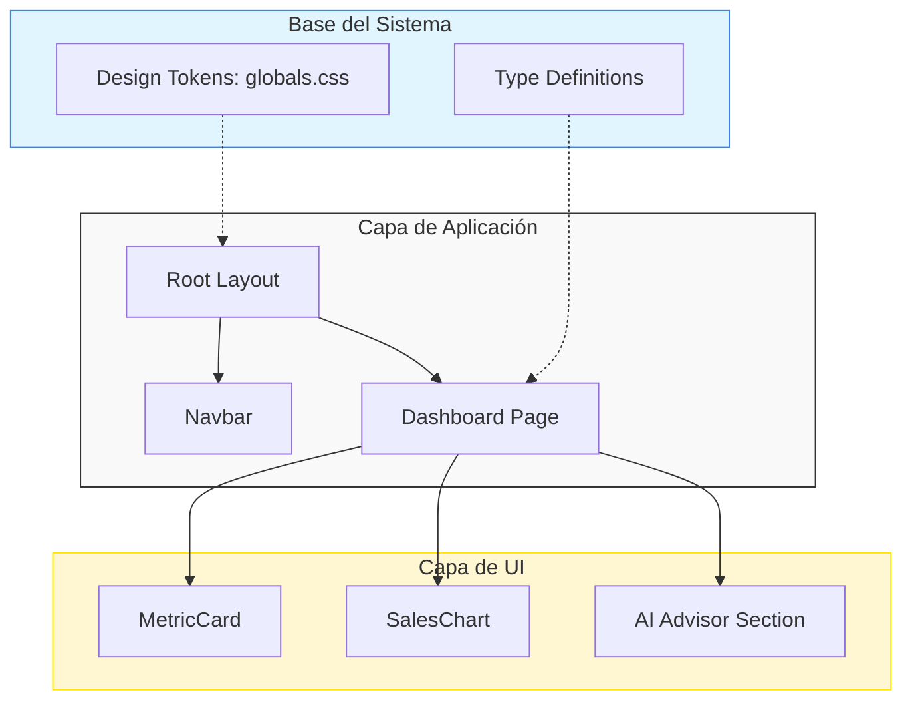

# AUTODOC: Arquitectura del Proyecto

Este documento proporciona una visión técnica de alto nivel del Seller Command Center, analizando su composición y patrones de diseño.

## Tech Stack Overview

| Tecnología | Versión | Propósito |
| :--- | :--- | :--- |
| **Next.js** | 16.1.6 | Framework principal (App Router). |
| **React** | 19.2.3 | Motor de renderizado de componentes. |
| **TypeScript** | 5.x | Lenguaje con tipado estático para robustez del código. |
| **Tailwind CSS** | 4.x | Sistema de estilos basado en utilidades y tokens. |
| **Framer Motion** | 12.34.3 | Motor de animaciones para la experiencia premium. |
| **Recharts** | 3.7.0 | Visualización de datos complejos. |

## Architecture Diagram



## Project Structure

```text
/
├── src/
│   ├── app/           # Orquestación de rutas y estilos globales
│   │   ├── layout.tsx # Shell persistente (Navbar + Metadatos)
│   │   ├── page.tsx   # Punto de convergencia del Dashboard
│   │   └── globals.css # Fuente de verdad de la identidad visual
│   └── components/     # Unidades funcionales reutilizables
│       ├── MetricCard.tsx # Visualizador de KPIs
│       ├── Navbar.tsx     # Cabecera corporativa lucubrada
│       └── SalesChart.tsx # Motor gráfico de analíticas
├── docs/               # Artefactos de documentación generados
└── public/             # Recursos estáticos y branding
```

### Anatomía del Proyecto
- **Patrón**: Arquitectura orientada a componentes en Next.js, utilizando Server Components por defecto pero habilitando interactividad mediante `"use client"` en nodos específicos.
- **Entry Point**: El archivo `src/app/page.tsx` es el cerebro donde se inyectan los datos mock y se orquesta la lógica del AI Advisor.
