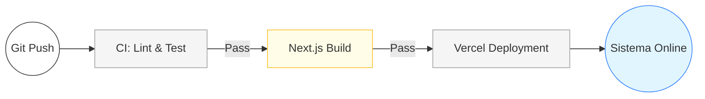

# AUTODOC: CI/CD Pipeline (Flujo de Entrega)

Descripción del proceso de automatización desde el desarrollo hasta la producción.

## 1. Diagrama del Pipeline

## 2. Fases del Flujo

### Fase 1: Integración (CI)
Ejecución de auditorías estáticas (ESLint) para garantizar calidad de código.

### Fase 2: Construcción (Build)
Compilación de TypeScript y generación de assets optimizados para Next.js.

### Fase 3: Despliegue (CD)
Actualización automática de servidores edge mediante Vercel (CD).

---

## 3. Criterios de Éxito
Solo el código que pasa todas las validaciones de tipos y estilo es desplegado al entorno de producción.
