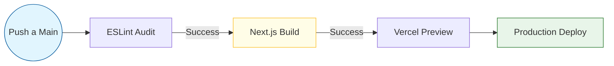

# AUTODOC: CI/CD Pipeline (Flujo de Entrega)

Este documento describe el flujo de automatización que garantiza la calidad y disponibilidad del código en el entorno de producción.

## 1. Diagrama del Pipeline

El flujo de despliegue sigue un modelo de Integración Continua (CI) y Despliegue Continuo (CD) optimizado:

## 2. Detalles de las Etapas

### Etapa 1: Calidad (Linting)
- **Herramienta**: ESLint.
- **Propósito**: Asegurar que el código cumple con las reglas de estilo y buenas prácticas de Next.js y TypeScript antes de intentar la compilación.

### Etapa 2: Optimización (Building)
- **Herramienta**: Next.js Compiler + Tailwind CSS PostCSS.
- **Acción**: Minificación de JavaScript, optimización de imágenes y purga de CSS no utilizado. Se generan las rutas estáticas y los componentes de servidor.

### Etapa 3: Entrega Continental (Deploy)
- **Plataforma**: Vercel.
- **Mecánica**: La integración nativa con GitHub detecta el "commit" en la rama principal y dispara el despliegue automático a los servidores edge en menos de 1 minuto.

---

## 3. Criterios de Éxito
Para que un despliegue sea aceptado, debe pasar el control de **Cero Errores de Tipado** (TypeScript) y el **Análisis Estático** (Lint), garantizando que solo código robusto llegue al usuario final.
