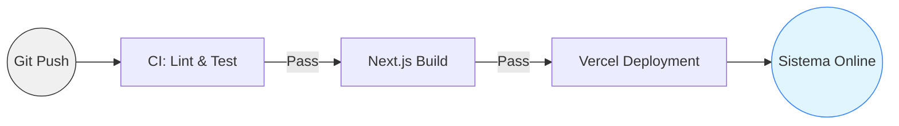

# AUTODOC: CI/CD Pipeline (Flujo de Entrega)

Descripción del proceso de automatización desde el desarrollo hasta la producción.

## 1. Diagrama del Pipeline

## 2. Fases del Flujo

### Fase 1: Integración (CI)
Ejecución de auditorías estáticas (ESLint) para garantizar que el código enviado a la rama principal cumple con los estándares de calidad definidos.

### Fase 2: Construcción (Build)
Compilación del código TypeScript y generación de los assets estáticos. Se procesan los componentes de servidor de Next.js para optimizar la carga inicial.

### Fase 3: Despliegue (CD)
Actualización automática de los servidores en el edge mediante Vercel, asegurando que la última versión del Seller Command Center esté disponible globalmente sin tiempo de inactividad.
