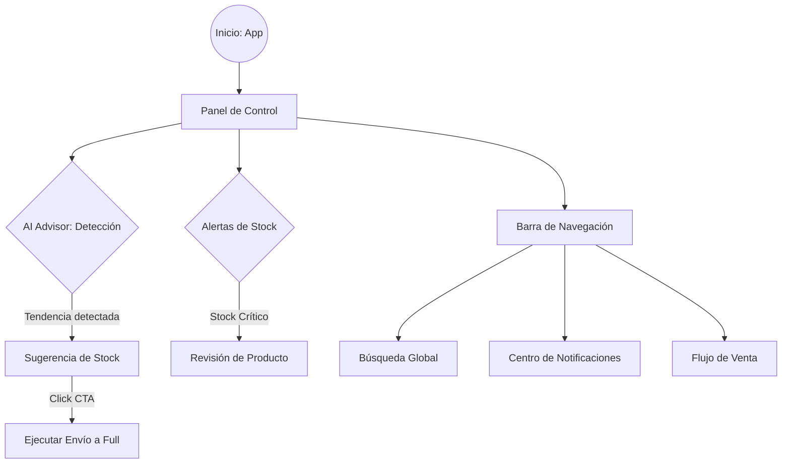

# AUTODOC: User Journeys (Flujos de Usuario)

Este documento describe las rutas críticas y la experiencia interactiva que un vendedor recorre dentro del Seller Command Center.

## 1. Mapa de Flujos Funcionales

El siguiente diagrama detalla la interacción del usuario con las capacidades de inteligencia artificial y gestión del dashboard:

---

## 2. Descripción de Rutas Críticas

### A. Flujo de Optimización Logística (AI-Driven)
Es el camino de mayor valor en el laboratorio. Comienza de forma proactiva por parte del sistema.
1. **Detección**: El motor de IA analiza las tendencias de venta en tiempo real.
2. **Notificación**: Se presenta un insight visual en el dashboard ("AI Advisor").
3. **Decisión**: El vendedor revisa la recomendación (ej: "Incrementar stock en 50 unidades").
4. **Ejecución**: Mediante el botón "Sugerir Envío a Full", el usuario inicia el trámite logístico.

### B. Gestión Preventiva de Inventario
Camino de monitoreo constante para evitar pérdida de ventas por falta de stock.
1. **Monitoreo**: El usuario visualiza la tarjeta de "Stock Crítico" en el panel de métricas.
2. **Identificación**: Se desplaza a la sección de "Alertas de Stock" para identificar los SKUs específicos.
3. **Navegación**: Interactúa con la lista de alertas para profundizar en el estado de cada producto.

### C. Navegación y Búsqueda Corporativa
Flujos estándar de soporte a la operación diaria.
- **Búsqueda**: Acceso rápido a productos o marcas desde cualquier vista.
- **Venta**: Punto de entrada al flujo de creación de publicaciones mediante el link "Vender".

---

## 3. Resumen de Soporte
Actualmente, el software soporta un ciclo completo de **visualización -> detección proactiva -> acción correctiva**, centrado especialmente en la eficiencia logística y el aprovechamiento de tendencias de mercado.

**Nota de Estilo**: Evitar el uso de iconos o emojis innecesarios en el documento final para mantener una estética profesional y limpia.
