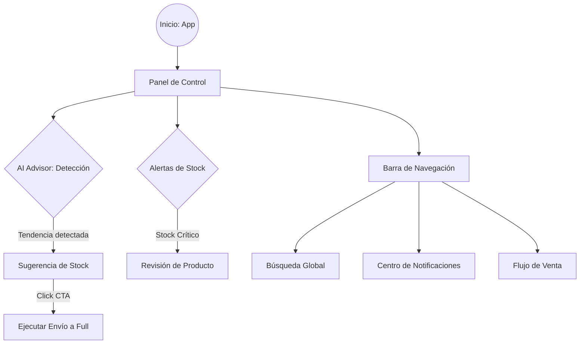

# AUTODOC: User Journeys (Flujos de Usuario)

Este documento describe las rutas críticas que un vendedor recorre dentro del Seller Command Center para optimizar su operación.

## 1. Mapa de Flujos Funcionales

El siguiente diagrama detalla la interacción del usuario con las capacidades de inteligencia artificial y gestión del dashboard:

## 2. Descripción de Rutas Críticas

### A. Flujo de Optimización Logística (Predictivo)
Es el camino de mayor valor estratégico. El sistema detecta proactivamente una oportunidad de mercado y guía al vendedor hacia la acción.
1. **Detección**: El motor de IA identifica SKUs con tendencia de crecimiento > 30%.
2. **Visualización**: Se presenta un insight proactivo en el área del "AI Advisor".
3. **Conversión**: El usuario valida la sugerencia y dispara el proceso de envío a centros de distribución (Full).

### B. Monitoreo Táctico de Inventario
Camino de control para asegurar la continuidad de las ventas.
1. **Identificación**: El usuario detecta indicadores en rojo en la tarjeta de "Stock Crítico".
2. **Análisis**: Revisa la lista de alertas para priorizar la reposición de productos con menor cobertura.

---

## 3. Resumen de Soporte Operativo
El software soporta actualmente un ciclo cerrado de **Detección de Datos -> Sugerencia Inteligente -> Acción Comercial**, mitigando el riesgo de pérdida de ventas por falta de stock.
